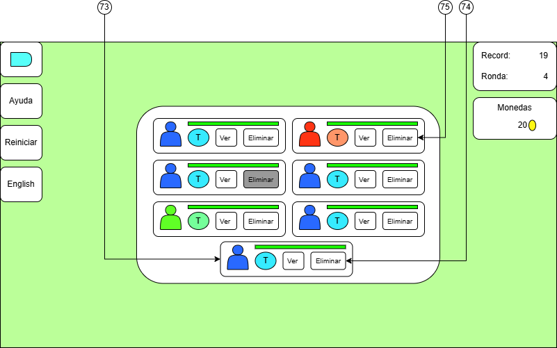
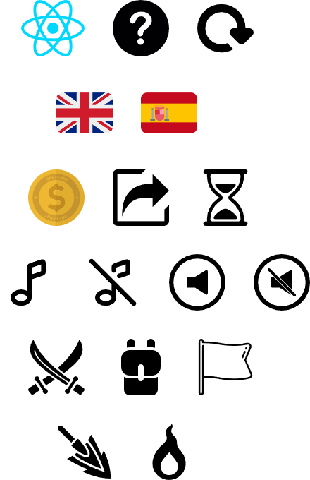
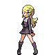

# Reactmon: Game Design Document (GDD)

## Motivación

Este proyecto empezó como una forma de practicar mis habilidades de programación y aprender/asentar conocimientos de React.

No hay intenciones de comercializar este proyecto y no me importa que otras personas lo utilicen o mejoren.


## Temática

### Concepto

La idea inicial consiste en un juego de combates por turnos entre oponentes que cuentan con equipos de criaturas variadas en el que el ganador puede quedarse con parte del equipo del perdedor para hacerse más fuerte.

El perdedor pierde el avance y debe empezar desde el principio, conservando solo el record de la ronda más avanzada a la que ha llegado.

El objetivo principal es ganar todos los combates posibles para ver cuantas rondas puede aguantar e intentar establecer records cada vez más altos.

### Géneros

- Combate por turnos.
- Estrategia.
- Roguelike.
- Juego de navegador.

### Mundo

El juego no cuenta con un mapa sobre el que desplazarse más allá de los menús que se presentan al usuario para hacer elecciones. Lo más parecido es la pantalla del Campo de Batalla en el que combaten las criaturas donde todos los elementos son estáticos en 2D tratando de simular una perspectiva 3D.

El Campo de Batalla es solo una representación visual de las acciones tomadas por los usuarios durante la batalla a través del Menú de Batalla.

Los elementos principales de este Campo de Batalla son el fondo de pantalla que ayuda a ambientar el escenario, las criaturas que combaten y una pequeña representación del suelo cuyo color depende del fondo.

### Perspectiva del Jugador

La vista del jugador durante el combate es en tercera persona viendo con una ligera perspectiva tanto a la criatura que maneja como a la criatura del enemigo. Se podría considerar primera persona si se considera que el jugador ve la acción a través de los ojos del personaje elegido en lugar de espectar a su criatura en combate.

### Aspecto general


El estilo general que se ha buscado en los elementos gráficos consiste en dibujos de estilo cartoon para crear una ambientación amigable.

La ambientación de los fondos es principalmente de ambientes naturales para dar sensación de aventura, aunque también hay un fondo principal de ciudad actual. Los dibujos de los personajes que se pueden elegir como avatar también tienen vestimentas actuales lo que refuerza la sensación de estar en una época similar a la actual.

Todo esto en conjunto trata de generar un ambiente de aventura tranquila situada en el presente, pero desarrollada en la naturaleza.


## Jugabilidad

### Resumen de Mecánicas

- El jugador es un actor externo al juego que toma decisiones sobre las acciones y organización de las criaturas de su equipo.
- En la pantalla de Elegir Avatar (la primera), el jugador elige un personaje que lo represente durante la partida, tras esto se cambia a la pantalla de Escribir Nombre.
- En la pantalla de Escribir Nombre se decide el nombre del jugador y se pulsa continuar para avanzar a la pantalla de Elegir primera criatura.
- En la pantalla de Elegir Criatura se dan tres criaturas entre las que elegir una para que el jugador la añada a su equipo, tras lo cual se avanza a la pantalla de Vista Previa de la Batalla.
- En la pantalla de Elegir Criatura el jugador puede pulsar el botón de ver para consultar las estadísticas y ataques de cada criatura.
- En la Vista Previa de la Batalla se muestra la información básica de los dos jugadores y sus criaturas, cada uno debe elegir una criatura con la que iniciará el combate y avanzaran a la pantalla de Campo de Batalla.
- El jugador elige la acción que realizará su criatura en cada turno de combate, tras lo cual el combate avanzará teniendo en cuenta el ataque decidido por el enemigo y las características de las criaturas y los ataques reduciendo la vida de las criaturas en consecuencia.
- El jugador puede utilizar su turno para cambiar su criatura por otra de su equipo, pero esto gastará el turno por lo que el enemigo puede realizar un ataque a la criatura nueva.
- El jugador puede decidir rendirse para terminar la partida y guardar su record actual.
- Si el jugador vence a todas las criaturas enemigas avanzará a la pantalla de Elección de Recompensas donde puede elegir entre quedarse con una criatura enemiga, quedarse con un ataque de una criatura enemiga para enseñárselo a una de sus criaturas o recibir monedas, tras lo cual se avanza a la Vista Previa de la siguiente Batalla o a la Tienda.
- Cada cierto número de rondas aparecerá una Tienda en la que el jugador puede comprar una criatura, pagar por cambiar las criaturas disponibles y ver la información de las criaturas que puede comprar, al terminar puede pulsar el botón salir para avanzar a la Vista Previa de la siguiente Batalla.

### Habilidades Requeridas

Las habilidades mínimas que se requieren por parte del jugador, que se utilizaran o que se pondrán a prueba son las siguientes.

**Habilidades Físicas:**

- Mover el ratón hacia las opciones para seleccionarlas.
- Pulsar los botones del ratón.
- Escribir.

**Habilidades Mentales:**

- Saber analizar la información de las criaturas elegibles para obtener la más útil según la situación.
- Planificar como componer el equipo a futuro para obtener combos de estadísticas y ataques efectivos.
- Saber que ataques buscar para enseñar a tus criaturas y cuando buscarlos.
- Saber cuándo eliminar criaturas del equipo para reemplazarlas por otras.
- Saber decidir cuándo elegir monedas como recompensa.
- Saber cuándo comprar criaturas en la tienda.
- Saber realizar cambios de criaturas en combate efectivos para minimizar perdidas.
- Observar la representación de las criaturas enemigas para adivinar sus capacidades y contrarrestarlas.
- Predecir las acciones del enemigo en combate.
- Saber elegir los ataques más efectivos según la situación del combate.
- Saber elegir la mejor criatura para iniciar un combate según el equipo enemigo.

**Habilidades Sociales (Si se implementa el Multijugador):**

- Evitar comportamientos tóxicos como hacer esperar al rival a propósito.
- Evitar hacer mal uso de los nombres como escribir insultos.

### Objetivos

El objetivo principal del jugador en una ronda es derrotar a todas las criaturas del oponente, y el objetivo principal general es derrotar a todos los oponentes posibles en una partida para aumentar el record de rondas alcanzadas.

Los objetivos secundarios son los que se plantee el jugador, desde conseguir un equipo ideal hasta cumplir con algún reto impuesto por sí mismo.

### Retos

- Evitar que la criatura actual pierda toda su vida en combate.
- Evitar perder a todas las criaturas en combate.
- Planificar la incorporación de criaturas.
- Planificar la incorporación de ataques.
- Planificar la gestión de las monedas.
- Planificar con qué criatura iniciar el combate.
- Planificar cambios de criatura en combate.

### Recursos

**Criaturas:**

Las criaturas además de ser el medio por el que el jugador interactúa con el oponente en combate también son un recurso que podemos obtener al derrotar al oponente.

El valor de este recurso está dividido entre las estadísticas de la criatura y sus ataques.

Las estadísticas determinan la mayor parte del valor de una criatura o por lo menos el valor a largo plazo. Esto se debe a que las estadísticas no pueden cambiarse por lo que si una criatura no tiene las estadísticas adecuadas para la estrategia del jugador o se quieren conseguir mejores la única solución es reemplazar la criatura por otra con las estadísticas deseadas.

**Ataques:**

Forman parte de las criaturas y determinan parte de su valor. Esto se debe a que tener una criatura con buenas estadísticas, pero sin ataques utilizables, puede considerarse una inversión de futuro, pero si no se cuentan con otras criaturas que puedan mantener el combate el jugador está condenado a perder la ronda.

Además, los ataques también son un recurso porque pueden obtenerse para cambiar la configuración de ataques de las criaturas del jugador. Esto permite configurar estrategias con libertad.

**Monedas:**

Este es un recurso extra que sirve para obtener los dos anteriores en las Tiendas. Se comienza el juego con suficientes para comprar una criatura.

### Modos de Juego (GameStates)

- Modo Empezar (START): Es la etapa inicial del juego donde el jugador determina los datos básicos del personaje y escoge la primera criatura para su equipo.
- Modo Información: Es la pantalla que muestra las estadísticas y ataques de la criatura.
- Modo Batalla (BATTLE): Es el desarrollo del combate, en donde los jugadores atacaran e intercambiaran criaturas según la situación.
- Modo Ganar (WIN): Se desencadena al derrotar a todas las criaturas del oponente, se elige entre varias recompensas para fortalecerse para la siguiente batalla.
- Modo Nuevo Objeto (NEW_ITEM): Pantalla en la que tras obtener un nuevo elemento para añadir al equipo (criatura o ataque) se decidirá por que otros elementos sustituirlo.
- Modo Perder (LOSE): Tras perder a todas las criaturas en combate se muestra el resumen final del estado del jugador y sus criaturas, solo queda iniciar otra partida.
- Modo Comprar (SHOPPING): Pantalla extra que aparecerá cada varias rondas donde se podrán obtener criaturas y ataques con más información disponible a cambio de monedas.
- Modo Ayuda: Pantalla accesible en cualquier momento para consultar información relevante sobre el juego.

### Acciones

**Siempre Disponibles**

| Limitaciones | Acciones | Descripción | Resultados |
| :--- | :---: | :--- | :--- |
| | **Reiniciar Juego** | Volver al inicio del juego | - Se vuelven a inicializar las variables internas y se cambia a la pantalla de Selección de Avatar |
| | **Ver Ayuda** | Mostrar información relevante del juego a modo de guía | - Cambia a la pantalla de Ayuda |
| - El nuevo Idioma no es el actual | **Cambiar Idioma** | Cambiar el idioma de los textos del juego | - Establece el idioma elegido como el actual |

**Modo Empezar**

| Limitaciones | Acciones | Descripción | Resultados |
| :--- | :---: | :--- | :--- |
| | **Elegir Avatar** | Seleccionar uno de los aspectos de personaje disponibles para el jugador mostrados en pantalla | - Se guarda el personaje como avatar del jugador |
| - Tiene al menos 3 letras <br/> - Tiene 13 letras máximo <br/> - No tiene solo espacios en blanco | **Escribir Nombre** | Escribir el nombre que utiliza el juego para referirse al jugador en la entra de texto disponible | - Se muestra el nombre escrito por el jugador |
| - Hay un nombre válido | **Confirmar Nombre** | Al hacer click en continuar se guarda el nombre | - Guardar nombre y avanzar a la Elección de Criatura si es válido <br/> - Seguir en la pantalla actual si no es válido |
| | **Elegir Criatura** | Seleccionar una criatura y empezar el combate | - Añadir la criatura indicada al equipo del jugador y Avanzar al modo de Batalla |
| | **Ver Información de Criatura** | Abre la pantalla de Información de la criatura | - Cambia a la pantalla de Información de la criatura |

**Modo Información**

| Limitaciones | Acciones | Descripción | Resultados |
| :--- | :---: | :--- | :--- |
| | **Ver Estadísticas** | Mostrar la información de las estadísticas de la criatura seleccionada | - Mostrar los valores numéricos de las estadísticas de la criatura |
| | **Ver Ataque** | Mostrar la información del ataque seleccionado de la criatura | - Mostrar todos los datos relacionados con el ataque seleccionado |
| | **Volver** | Regresar a la pantalla anterior | - Regresar a la pantalla donde se muestra la criatura que se seleccionó |

**Modo Batalla**

| Limitaciones | Acciones | Descripción | Resultados |
| :--- | :---: | :--- | :--- |
| - Estar en la Vista Previa de la Batalla <br/> - La criatura seleccionada no debe estar debilitada | **Elegir Primera Criatura** | Decidir cuál de las criaturas del equipo iniciará el combate | - Avanza a la pantalla de Batalla y la criatura que está en combate es la elegida |
| - No estar en el menú de Mensajes de Batalla | **Luchar** | Ver los ataques para elegir realizar uno | - Muestra los ataques de la criatura en combate |
| - No estar en el menú de Mensajes de Batalla | **Elegir Ataque** | Seleccionar un ataque de la criatura para ejecutarlo en el combate | - El ataque seleccionado se guarda como la acción que se realizará en combate y se avanza al menú de Mensajes de Batalla donde se describirá el curso del combate mediante texto |
| - No estar en el menú de Mensajes de Batalla | **Cambiar** | Ver las criaturas del equipo para poder cambiar la actual | - Cambia a la pantalla Mochila en la que se muestran todas las criaturas del equipo |
| - No estar en el menú de Mensajes de Batalla <br/> - La criatura seleccionada no debe estar debilitada | **Elegir Criatura** | Seleccionar una criatura del equipo para cambiarla por la actual | - La criatura elegida sale al combate intercambiándose por la que había y se avanza a la pantalla de Mensajes de Batalla donde se describirá el curso del combate mediante texto |
| - No estar en el menú de Mensajes de Batalla | **Ver Información de Criatura** | Mostrar la información de una criatura concreta del equipo | - Cambia a la pantalla de Información de la criatura |
| - No estar en el menú de Mensajes de Batalla | **Volver** | Volver al menú general de Luchar o Cambiar | - Cambia al menú general de batalla con las opciones de Luchar y Cambiar |
| - Estar en el menú de Mensajes de Batalla | **Siguiente Mensaje de Batalla** | Ver el siguiente mensaje que describe el avance del combate | - Se ejecuta la siguiente acción del combate y se muestra el texto que la describe |
| - No estar en el menú de Mensajes de Batalla | **Rendirse** | Terminar el juego e ir al resumen final | - Se avanza a la pantalla de Perder |

**Modo Ganar**

| Limitaciones | Acciones | Descripción | Resultados |
| :--- | :---: | :--- | :--- |
| | **Ir a Elección de Criatura Enemiga** | Elegir Añadir una criatura enemiga al equipo | - Cambia a la pantalla de Elección de criatura |
| | **Elegir Criatura Enemiga** | Añadir criatura seleccionada al equipo | - Añade la criatura al equipo y avanza a la siguiente Batalla o a la Tienda <br/> - Si no hay espacio la guarda como criatura a añadir y avanza a la pantalla de Nueva Criatura |
| | **Ver Información de Criatura** | Mostrar la información de la criatura seleccionada | - Cambia a la pantalla de Información de la criatura |
| | **Ir a Elección de Ataque Enemigo** | Elegir Añadir un ataque de una criatura enemiga a una criatura del equipo | - Cambia a la pantalla de Elección de Ataque |
| | **Elegir Ataque Enemigo** | Añadir ataque seleccionado a una criatura del equipo | - Guarda el ataque como ataque a añadir y avanza a la pantalla de Nuevo Ataque |
| | **Ver Descripción de Ataque** | Mostrar la descripción del ataque seleccionado | - Hace visible la descripción del Ataque |
| | **Conseguir Monedas** | Elegir aumentar las monedas para la tienda | - Aumenta monedas y avanza a la siguiente Batalla o a la Tienda |

**Modo Nuevo Objeto**

| Limitaciones | Acciones | Descripción | Resultados |
| :--- | :---: | :--- | :--- |
| - Nueva criatura | **Eliminar Criatura** | Descarta la criatura elegida para añadir la nueva | - Elimina la criatura del equipo y añade la nueva si no era la seleccionada, avanza a la siguiente Batalla o a la Tienda |
| | **Ver Información de Criatura** | Mostrar la información de la criatura seleccionada | - Cambia a la pantalla de Información de la criatura, si el nuevo objeto es un Ataque Muestra la opción Enseñar u Olvidar |
| - Nuevo Ataque | **Enseñar Ataque** | Añadir ataque a la criatura seleccionada | - Añade el ataque nuevo a la criatura seleccionada y avanza a la siguiente Batalla o a la Tienda |
| - Nuevo Ataque | **Olvidar Ataque** | Eliminar ataque seleccionado para añadir el nuevo | - Elimina el ataque seleccionado para cambiarlo por el ataque nuevo y avanza a la siguiente Batalla o a la Tienda |
| - Nuevo Ataque | **Ver Descripción de Ataque** | Mostrar la descripción del ataque que se quiere añadir | - Hace visible la descripción del Ataque que se quiere añadir |

**Modo Comprar**

| Limitaciones | Acciones | Descripción | Resultados |
| :--- | :---: | :--- | :--- |
| - Tener Suficientes Monedas | **Comprar** | Gastar Monedas para obtener una criatura | - Cambia a la pantalla de Información de la criatura con las opciones de Añadir Criatura y Extraer Ataque |
| - Haber Comprado una Criatura | **Añadir Criatura** | Añadir la criatura comprada al equipo | - Cambia a la pantalla de Nueva Criatura con la criatura seleccionada |
| - Haber Comprado una Criatura | **Extraer Ataque** | Añadir el ataque seleccionado de la criatura comprada a una criatura del equipo | - Cambia a la pantalla de Nuevo Ataque con el ataque seleccionado |
| | **Ver Información de Criatura** | Mostrar la información de la criatura seleccionada | - Cambia a la pantalla de Información de la criatura |
| - Tener Suficientes Monedas | **Actualizar Tienda** | Gastar monedas para cambiar las criaturas disponibles | - Genera nuevas criaturas disponibles en la Tienda |
| | **Ver Criaturas para Vender** | Ver el equipo del Jugador | - Cambiar a la pantalla de la Mochila con la opción de Vender Criatura incluida |
| - No haber vendido ninguna criatura en esta tienda todavía | **Vender Criatura** | Eliminar una criatura del equipo para obtener Monedas | - Elimina una criatura del equipo y aumenta las monedas |
| | **Salir** | Avanzar a la siguiente Batalla | - Avanzar a la siguiente Batalla |

**Modo Ayuda**

| Limitaciones | Acciones | Descripción | Resultados |
| :--- | :---: | :--- | :--- |
| | **Volver** | Volver a la pantalla anterior | - Cambia a la pantalla anterior |

### Interacciones

**Interacciones del Inicio**

| Limitaciones | Interacciones | Descripción | Resultados |
| :--- | :---: | :--- | :--- |
| - Hay Información local guardada | **Cargar Información del Jugador** | Iniciar los datos del jugador con información guardada de anteriores partidas | - Se inicializa el nombre, el Avatar y el record del jugador con la información almacenada en el cliente |

**Interacciones de las Criaturas**
| Limitaciones | Interacciones | Descripción | Resultados |
| :--- | :---: | :--- | :--- |
| - Estar en la Elección de Primera Criatura <br> - Estar en la Vista Previa de La Batalla <br> - Estar en la Tienda | **Generar Criatura** | Crear una nueva criatura de forma aleatoria | - Se genera una nueva criatura para ser utilizada en la pantalla correspondiente |
| - Estar en Batalla <br/> - Perder todos los puntos de vida | **Debilitarse** | La criatura queda fuera de combate | - Disminuyen las criaturas disponibles del jugador |
| - Estar en Batalla <br/> - Jugador a seleccionado un ataque | **Realizar Ataque** | La criatura ejecuta un ataque indicado por el jugador | - Reducción de vida de la criatura enemiga si es ataque Físico o Especial <br/> - Mejora de Estadísticas si es Ataque de Apoyo de Mejora <br/> - Regeneración de vida si es Ataque de Apoyo de Curación |

**Interacciones de los Jugadores**
| Limitaciones | Interacciones | Descripción | Resultados |
| :--- | :---: | :--- | :--- |
| - Estar en la Vista Previa de la Batalla <br/> - No es Batalla Multijugador | **Generar Rival** | Generar un Rival NPC para la Batalla de forma aleatoria | - Generar Nombre, Avatar, Record y Criaturas |
| - Estar en la Vista Previa de la Batalla | **Curar Criaturas** | Regenerar la vida de todas las Criaturas antes de la Batalla | - La vida actual de las Criaturas es su Vida Máxima |
| - Estar En Batalla <br/> - Rival NPC | **Generar acción de ataque aleatorio** | El Rival elige un ataque aleatorio | - Se genera un índice aleatorio de la lista de ataques de la criatura actual del Rival |
| - Estar en Batalla <br/> - Criatura del Jugador o Rival debilitada <br/> - Quedan criaturas disponibles | **Cambio Forzado** | Cambiar la criatura por otra debido a debilitamiento | - Ir a la mochila para elegir nueva criatura <br/> - Si NPC se elige automáticamente una criatura aleatoria de entre las disponibles |
| - Estar en Batalla <br/> - No quedan criaturas al Rival | **Ganar** | Ir a la Selección de Recompensas | - Avanzar a la pantalla de Ganar |
| - Estar en Batalla <br/> - No quedan criaturas al Jugador | **Perder** | Terminar el juego e ir al resumen final | - Se avanza a la pantalla de Perder |

**Interacciones del Fin**

| Limitaciones | Interacciones | Descripción | Resultados |
| :--- | :---: | :--- | :--- |
| | **Guardar Información del Jugador** | Almacenar información del jugador en el cliente | - Guardar nombre, Avatar y record en el cliente |

### Reglas

**Relacionadas a Acciones**

Modo Ganar:

| Objetivo | Regla |
| :--- | :--- |
| Ir a Elección de Criatura Enemiga | Si el Rival derrotado era un Jefe, entonces las Criaturas disponibles serán 3 criaturas aleatorias de las 6 que tenía |
| Ir a Elección de Ataque Enemigo | Si el Rival derrotado era un Jefe, entonces los Ataques disponibles serán de 3 criaturas aleatorias de las 6 que tenía |
| Conseguir Monedas | Si el Rival derrotado era un Jefe, entonces se recibirá una cantidad mayor de Monedas |

Modo Nuevo Objeto:

| Objetivo | Regla |
| :--- | :--- |
| Enseñar Ataque | Si el ataque es Neutro, del mismo Tipo Elemental que la Criatura o del Tipo Elemental contra el que la Criatura es débil, entonces puede ser aprendido por la Criatura |
| Olvidar Ataque | Si al olvidar el ataque seleccionado y aprender el nuevo la Criatura no se queda sin ataques que Inflijan daño al enemigo, entonces puede Olvidar el Ataque seleccionado |
| Avanzar Siguiente Batalla (acción secundaria de varios botones) | Si la última ronda terminada es múltiplo de 10, entonces se avanza a la Tienda antes de la Siguiente Batalla |

**Relacionadas a Interacciones**

Interacciones de las Criaturas:

| Objetivo | Regla |
| :--- | :--- |
| Generar Criatura | Se reparten 280 puntos totales entre las Estadísticas, siendo 100 el valor máximo de una sola estadística y 30 el valor mínimo que puede tener la Vida Máxima |
| Generar Criatura | Se escoge el Tipo Elemental de forma aleatoria entre los 3 principales, excluyendo al Neutro |
| Generar Criatura | La Criatura tiene al menos un ataque que inflija daño al enemigo |
| Generar Criatura | Si la criatura destaca en alguna estadística concreta, entonces las imágenes de criaturas posibles que se le pueden asignar son aquellas relacionadas con dicha estadística |
| Generar Criatura | Según el Tipo Elemental de la criatura se establecerá su patrón de colores principal |
| Generar Criatura | Dependiendo los valores de las estadísticas relacionadas con el tipo de la criatura se establecerá el tono (más claro u oscuro) de los colores de la criatura, un tono más oscuro indica que una de estas estadísticas destaca por ser muy baja mientras que un tono más claro indica que una de estas estadísticas destaca por ser más alto |
| Generar Criatura | Si la pantalla es la Elección de primera Criatura, entonces las criaturas generadas solo tienen un ataque, tienen una estadística al máximo asegurada y se genera una de cada Tipo Elemental |
| Generar Criatura | La criatura del primer rival es débil contra el Tipo Elemental de la primera Criatura del Jugador |
| Realizar Ataque | Si el ataque es de Categoría Física, entonces la potencia aumenta en función del Ataque Físico de la Criatura que lo realiza y se reduce en función de la Defensa Física de la Criatura que lo recibe |
| Realizar Ataque | Si el ataque es de Categoría Especial, entonces la potencia aumenta en función del Ataque Especial de la Criatura que lo realiza y se reduce en función de la Defensa Especial de la Criatura que lo recibe |
| Realizar Ataque | Si el ataque es de Categoría Apoyo y es de Mejora de Estadística, entonces se aplica una mejora acumulable hasta 5 veces en la estadística a la que se aplica el ataque de la Criatura que lo realiza |
| Realizar Ataque | Si el ataque es de Categoría Apoyo y es de Curación, entonces la Criatura que realiza el ataque regenera una cantidad fija de puntos de vida |
| Realizar Ataque | Si el ataque realizado es del mismo Tipo Elemental que la criatura que lo realiza, entonces la potencia del ataque aumenta, también se aplica a ataques de apoyo |
| Realizar Ataque | Si el ataque realizado es de un Tipo Elemental fuerte contra el Tipo Elemental de la Criatura que lo recibe, entonces la potencia aumenta |
| Realizar Ataque | Si el ataque realizado es de un Tipo Elemental débil contra el Tipo Elemental de la Criatura que lo recibe, entonces la potencia se reduce |

Interacciones de los Jugadores:

| Objetivo | Regla Operativa |
| :--- | :--- |
| Generar Rival | El primer Rival tiene una sola Criatura |
| Generar Rival | El número de Criaturas del Rival aumenta con cada ronda hasta llegar al máximo, una vez alcanzado el máximo de criaturas se aumenta el número de ataques totales conocidos por sus criaturas hasta llegar al máximo |
| Generar Rival | Si la ronda no es múltiplo de 10, entonces se genera un rival con 3 Criaturas máximo |
| Generar Rival | Si la ronda es múltiplo de 10 y mayor o igual que 20, entonces se genera un rival con 6 Criaturas máximo, esto se considera un Jefe |
| Generar Rival | Los jefes tienen una criatura con una estadística con valor máximo asegurada y otra Criatura con 2 estadísticas con valor máximo aseguradas |
| Curar Criaturas | Si la ronda es mayor que 20, entonces las criaturas solo se curan antes y después de un Jefe |

### Relación de Tipos Elementales

Fuego > Planta > Agua > Fuego

Neutro no es fuerte ni débil contra ningún otro Tipo Elemental.

### Cálculo de daño de Ataques Físicos y Especiales

`Damage = (A * T * E * P * Ax) / Dx`

- Ajuste (A = 0.15): Ajuste de balanceo para equilibrar ataque y defensa.
- Tipo (T = 1.5): Aumento por Ataque del mismo Tipo Elemental que la Criatura que lo realiza.
- Efectividad (E):
  - Alta (E = 2): Criatura débil contra Ataque recibido.
  - Baja (E = 0.5): Criatura fuerte contra Ataque recibido.
- Potencia Base (P = 100): Todos los ataques que inflijan daño tienen la misma potencia base.
- Ataque (Ax): Ataque Especial o Ataque Físico de la Criatura, dependiendo de la Categoría del Ataque.
- Defensa (Dx): Defensa Especial o Defensa Física de la Criatura que recibe el Ataque, dependiendo de la Categoría del Ataque.

### Estadísticas de las Criaturas (CreatureStats)

- Vida Máxima: Cantidad máxima de puntos de vida que puede tener la criatura completamente curada.
- Velocidad: Establece que criatura ataca primero durante el combate.
- Ataque Físico: Determina la potencia de los ataques Físicos.
- Ataque Especial: Determina la potencia de los ataques Especiales.
- Defensa Física: Determina la reducción de daño de los ataques Físicos recibidos.
- Defensa Especial: Determina la reducción de daño de los ataques Especiales recibidos.

Cada tipo Elemental tiene dos estadísticas relacionadas:

- Planta: Vida Máxima y Velocidad.
- Fuego: Ataque Físico y Ataque Especial.
- Agua: Defensa Física y Defensa Especial.

### Lista de Ataques (AttackList)

| Identificador | Nombre | Categoría | Tipo | Descripción |
| :--- | :--- | :--- | :--- | :--- |
| FireFist | Puño Fuego | Físico | Fuego | El enemigo recibe un puñetazo envuelto en llamas. |
| Flamethrower | Lanzallamas | Especial | Fuego | El enemigo es abrasado por una intensa explosión de fuego. |
| ThermalSharpening | Afilado Térmico | Apoyo | Fuego | Aumenta el daño físico puliendo sus garras con calor. |
| Ignition | Ignición | Apoyo | Fuego | Aumenta el daño especial aumentando su energía elemental. |
| FluidSlash | Cuchillada Fluida | Físico | Agua | El enemigo recibe una cuchillada lubricada con agua. |
| WaterCanon | Hidrocañón | Especial | Agua | El enemigo recibe un potente chorro de agua a presión. |
| FrozenShield | Blindaje Helado | Apoyo | Agua | Aumenta su defensa física rodeando su cuerpo con hielo. |
| AquaticAura | Aura acuática | Apoyo | Agua | Aumenta su defensa especial manipulando el agua a su alrededor. |
| ImpalingSpike | Espina Empaladora | Físico | Planta | El enemigo es impactado por una espina grande y afilada. |
| AcidBomb | Bomba Ácida | Especial | Planta | El enemigo recibe una explosión química corrosiva. |
| Doping | Autoestimulante | Apoyo | Planta | Aumenta su velocidad generando sustancias estimulantes dentro de su cuerpo. |
| Absorption | Absorber Nutrientes | Apoyo | Planta | Regenera parte de su vida absorbiendo nutrientes del terreno. |
| Headbutt | Cabezazo | Físico | Neutro | El enemigo recibe un cabezazo a gran velocidad. |
| AuraRay | Rayo de Aura | Especial | Neutro | El enemigo recibe un rayo generado a partir de pura energía. |


## Elementos Gráficos

### Interfaz de Usuario (UI / HUD)

**Elegir Avatar**


1. Icono del juego: Icono del juego y enlace al proyecto en GitHub.
2. Botón de Ayuda: Al pulsar este botón se accede a la pantalla de Ayuda.
3. Botón de Reinicio: Al pulsar este botón se empieza el juego desde el principio, la pantalla de Elegir Avatar.
4. Botón de Idioma Inglés: Al pulsar este botón se cambia el idioma a Ingles y se sustituye el botón por Idioma Español.
5. Avatar Seleccionado: Aspecto de personaje marcado por defecto, al pulsar en él se guarda como aspecto del jugador y avanza a la pantalla de Escribir nombre.
6. Avatar no Seleccionado: Aspectos de personaje no seleccionados por defecto. Mismo efecto al pulsar que el Seleccionado.
7. Record: Ronda máxima registrada a la que ha llegado el jugador en partidas anteriores.
8. Ronda: Ronda actual en la que se encuentra el juego.
9. Monedas: Cantidad de monedas disponibles para gastar en la Tienda.

**Escribir Nombre**


10. Avatar del Jugador: Imagen que representa al jugador en el juego.
11. Introducir Nombre: Cuadro de texto preparado para introducir el nombre del jugador.
12. Botón de Continuar: Al pulsar se guarda el nombre del jugador y avanza a la pantalla de Elegir primera Criatura.

**Elegir Criatura**


13. Contenedor de Criatura: Engloba todas las opciones e información de una criatura.
14. Imagen de Criatura: Imagen que representa a la criatura.
15. Tipo Elemental: Icono que indica el tipo Elemental de la criatura.
16. Botón de Elegir: Al pulsar añade la criatura al equipo del jugador y avanza a la siguiente pantalla, si el equipo está completo avanza a la pantalla de Mochila con la criatura elegida como Nueva Criatura.
17. Botón de Ver: Al pulsar muestra la pantalla de Información de la criatura.

**Información de Criatura (Estadísticas)**


18. Imagen de Criatura: Imagen que representa a la criatura.
19. Tipo Elemental: Icono que indica el tipo Elemental de la criatura.
20. Barra de Vida: Representación visual de la vida restante.
21. Valor de Vida: Representación numérica de la vida restante.
22. Botón de Estadísticas: Al pulsar muestra la Información de las Estadísticas de la criatura.
23. Botón de Volver: Al pulsar Vuelve a la pantalla anterior.
24. Nombre de Estadística: Nombre de estadística de la criatura.
25. Valor de Estadística: Valor de la estadística en esta criatura.
26. Máximo Valor Posible: Valor máximo posible de estadística para comparación.
27. Botón de Info de Ataque: Al pulsar Muestra la Información del Ataque seleccionado.
28. Nombre de Ataque: Nombre del Ataque de la criatura.
29. Categoría de Ataque: Icono que indica la Categoría del Ataque.
30. Tipo Elemental de Ataque: Icono que indica el tipo Elemental del Ataque.

**Información de Criatura (Ataque Seleccionado)**


31. Nombre de Ataque: Nombre del Ataque de la criatura.
32. Tipo Elemental de Ataque: Icono que indica el tipo Elemental del Ataque.
33. Categoría de Ataque: Icono que indica la Categoría del Ataque.
34. Descripción de Categoría: Explicación de cómo funcionan los ataques que pertenecen a esta Categoría.
35. Descripción de Ataque: Breve descripción de cómo funciona el Ataque seleccionado.


**Información de Criatura (Tipos Elementales)**


Pantalla descartada como parte de Información de Criatura, en su lugar se ha añadido esta información a la pantalla de Ayuda. La pantalla de Ayuda contaría solo con el contenedor de la información y el Botón de Volver.

**Batalla (Vista Previa)**


36. Información del Jugador: Contenedor con todos los datos del jugador principal y la lista de sus criaturas.
37. Avatar del Jugador: Imagen que representa al jugador en el juego.
38. Nombre del Jugador: Nombre guardado por el que se hace referencia al jugador dentro del juego.
39. Record del Jugador: Máxima ronda a la que ha llegado el Jugador en partidas anteriores.
40. Selección de Criatura: Botones que muestran las criaturas del equipo del jugador, al pulsar se inicia la batalla con esa criatura como inicial.
41. Imagen de Criatura: Imagen que representa a la criatura.
42. Tipo Elemental: Icono que indica el tipo Elemental de la criatura.
43. Información del Rival: Contenedor con todos los datos del Rival y la lista de sus criaturas.

**Batalla (Menú General)**


44. Imagen de Criatura del Jugador: Imagen que representa a la criatura actual en Batalla del Jugador principal.
45. Tipo Elemental: Icono que indica el tipo Elemental de la criatura actual del jugador principal.
46. Barra de Vida: Representación visual de la vida restante de la criatura del jugador principal.
47. Valor de Vida: Valor numérico de la vida restante de la criatura del jugador principal.
48. Terreno: Representación básica del terreno de combate.
49. Barra de Vida de Rival: Representación visual de la vida restante de la criatura del Rival.
50. Tipo Elemental del Rival:  Icono que indica el tipo Elemental de la criatura actual del Rival.
51. Imagen de Criatura del Rival: Imagen que representa a la criatura actual en Batalla del Rival.
52. Botón de Luchar: Al pulsar se cambia al menú de Selección de Ataques.
53. Botón de Cambiar: Al pulsar se cambia a la pantalla de Mochila para seleccionar una criatura del equipo.
54. Botón de Rendirse. Al pulsar se termina el juego y se avanza a la pantalla de Perder.

**Batalla (Menú de Ataques)**


55. Botón de Ataque: Al pulsar se inicia el desarrollo del combate con ese ataque como acción del jugador.
56. Nombre de Ataque: Nombre del Ataque de la criatura.
57. Categoría de Ataque: Icono que indica la Categoría del Ataque.
58. Tipo Elemental de Ataque: Icono que indica el tipo Elemental del Ataque.
59. Botón de Volver: Al pulsar vuelve al Menú General de Batalla.

**Batalla (Mensaje de Ataque)**


60. Animación de Ataque: Representación gráfica de la ejecución del ataque.
61. Mensaje actual: Descripción de la última acción que se ha ejecutado.
62. Botón de Continuar: Ejecutar la siguiente acción de la Batalla.

**Batalla (Mochila)**


63. Criatura del equipo: Contenedor con información básica y los botones correspondientes a una de las criaturas del equipo del jugador.
64. Imagen de Criatura: Imagen que representa a la criatura.
65. Tipo Elemental: Icono que indica el tipo Elemental de la criatura.
66. Barra de Vida: Representación visual de la vida restante.
67. Botón de Elegir: Al pulsar se saca la criatura al combate intercambiándola por la que estaba.
68. Botón de Ver: Al pulsar muestra la pantalla de Información de la criatura.
69. Botón de Volver: Al pulsar vuelve al Menú General de Batalla.

**Batalla (Mensaje de Cambio)**


**Ganar (Elegir Recompensa)**


70. Botón de Elegir Criatura: Al pulsar avanza a la pantalla de Elección de Criaturas con criaturas del Rival derrotado.
71. Botón de Elegir Ataque: Al pulsar avanza a la pantalla de Elección de Ataque con ataques de las criaturas del Rival derrotado.
72. Botón de Elegir Monedas: Al pulsar aumentan las Monedas del jugador y avanza a la siguiente Batalla.

**Ganar (Mochila Nueva Criatura)**



73. Nueva Criatura: Criatura del oponente que el jugador quiere añadir al equipo.
74. Botón de Descartar: Al pulsar se descarta la criatura nueva y se avanza a la siguiente Batalla.
75. Botón de Eliminar: Al pulsar se elimina la criatura seleccionada del equipo para añadir la criatura nueva del Rival.

**Ganar (Elegir Ataque)**


76. Ataque del Rival: Contenedor con información básica y botones de uno de los ataques de las criaturas del Rival.
77. Nombre de Ataque: Nombre del Ataque de la criatura del Rival.
78. Tipo Elemental de Ataque: Icono que indica el tipo Elemental del Ataque del Rival.
79. Botón de Elegir: Al pulsar se avanza a la Mochila con el ataque elegido como Nuevo Ataque.
80. Botón de Ver: Al pulsar se muestra la descripción del ataque en un cuadro de texto flotante que normalmente está oculto.

**Ganar (Información de Ataque)**


Pantalla descartada y sustituida por cuadro de texto flotante al lado del botón correspondiente, normalmente invisible.

**Ganar (Mochila Nuevo Ataque)**


81. Nuevo Ataque: Contenedor de info y botones del Nuevo Ataque que se quiere añadir.
82. Nombre de Ataque: Nombre del Ataque que se quiere añadir a una criatura del equipo.
83. Categoría de Ataque: Icono que indica la Categoría del Ataque.
84. Tipo Elemental de Ataque: Icono que indica el tipo Elemental del Ataque.
85. Botón de Descartar: Descartar el ataque nuevo y avanzar a la siguiente Batalla.
86. Botón de Ver Ataque: Al pulsar se muestra la descripción del ataque en un cuadro de texto flotante que normalmente está oculto.
87. Botón de Enseñar: Al pulsar se Muestra la pantalla de Información de la criatura con botones añadidos para enseñar el ataque.

**Ganar (Enseñar Ataque)**


88. Nuevo Ataque: Nuevo ataque que se quiere enseñar, al pulsar se selecciona y se muestra la Información del Ataque.
89. Botón de Olvidar: Al pulsar la criatura actual olvida el ataque seleccionado y lo sustituye por el nuevo ataque, y avanza a la siguiente Batalla.

**Tienda**


90. Criatura Disponible: Contenedor con información y botones de una de las criaturas disponibles en la tienda para comprar.
91. Imagen de Criatura: Imagen que representa a la criatura.
92. Tipo Elemental: Icono que indica el tipo Elemental de la criatura.
93. Precio: Monedas necesarias para comprar la criatura.
94. Botón de Comprar: Al pulsar se descuentan las monedas requeridas y se avanza a la pantalla de Criatura Comprada.
95. Botón de Ver: Al pulsar muestra la pantalla de Información de la criatura.
96. Botón de Actualizar Tienda: Al pulsar gasta monedas para cambiar las criaturas disponibles en la Tienda.
97. Botón de Mochila: Al pulsar cambia a la pantalla de Mochila con la posibilidad de vender criaturas del equipo.
98. Botón de Salir: Al pulsar avanza a la siguiente Batalla.

**Tienda (Criatura Comprada)**


99. Botón de Extraer Ataque: Al pulsar cambia a la pantalla de Mochila con el ataque de la criatura comprada seleccionado para añadirlo a una criatura del equipo.
100. Botón de Añadir Criatura: Al pulsar añade la criatura al equipo, o si ya está lleno se avanza a la Mochila para sustituir una criatura por la nueva.

**Fin del Juego**


101. Avatar del Jugador: Imagen que representa al jugador en el juego.
102. Nombre del Jugador: Nombre guardado por el que se hace referencia al jugador dentro del juego.
103. Record del Jugador: Máxima ronda a la que ha llegado el Jugador en partidas anteriores, actualizado si en esta partida a llegado más lejos.
104. Ronda Máxima: Ronda más alta a la que ha llegado el jugador en esta partida.
105. Criatura del equipo: Contenedor con la información visual básica de cada criatura del equipo.
106. Imagen de Criatura: Imagen que representa a la criatura.
107. Tipo Elemental: Icono que indica el tipo Elemental de la criatura.

### Iconos

**Opciones de Menús**



Procedentes de [SVG-Repo](#referencias).

**Categorías**


Procedentes de [SVG-Repo](#referencias).

**Tipos Elementales**


Procedentes de [duiker101](#referencias).

### Aspectos de Jugadores (PlayerSkins)

   

   

Procedentes de [Pokémon-Showdown](#referencias).

### Criaturas (CreatureList)


(Color Original de las criaturas)

Procedentes de [jnovack](#referencias).

### Fondos de Pantalla (BackgroundList)

**Ciudad**


**Pradera**


**Bosque**


**Mar**


**Desierto**


**Volcán**


Procedentes de [FREEPIK](#referencias).


## Detalles de Implementación

### Tecnologías Utilizadas

- Ubuntu 22.04.4 LTS, 64 bits, 16 GB RAM.
- Visual Studio Code 1.89.1.
- Firefox Browser 132.0.1 (64-bit).
- npm 8.6.0.
- Vite 5.4.8.
- React 18.3.1.
- Eslint 9.11.1.

### Preparación del Entorno de Desarrollo

Los comandos utilizados en la Terminal de Ubuntu, comenzando en la carpeta raíz del proyecto, para iniciar el proyecto son los mostrados a continuación.

Inicializar NPM en la carpeta raíz del proyecto:

```
npm init -y
```

Crear la carpeta del código del proyecto con Vite preparada para usar React:

```
npm create vite@latest
nombre-proyecto
React
JavaScript + SWC
```

Instalar las dependencias del proyecto:

```
cd ./nombre-proyecto/
npm install
npm install standard -D
```

Iniciar el servidor local, posicionado en la carpeta del código del proyecto, para poder acceder al proyecto en el navegador:

```
npm run dev
```

Para acceder al proyecto ejecutado en el servidor local desde el navegador usar la url `http://localhost:5173/` o `http://localhost:5173/react-reactmon/` después de hacer los cambios del Despliegue.

### Entidades y Atributos

(Expresión `f()` utilizada para indicar si un atributo depende de otros para su cálculo)

**Jugador (Player)**

- Nombre (name). `<string>`
  - Descripción: Cadena de caracteres con el nombre del Jugador.
- Imagen (image). `<Tag> in PlayerSkins`
  - Descripción: Nombre de la imagen utilizada como aspecto del Jugador.
- Record (record). `<int>`
  - Descripción: Máxima ronda alcanzada en partidas anteriores por el jugador.
  - `record = f(Game.round)`
- Criaturas (creatures). `<List<Creature>>`
  - Descripción: Criaturas que forman el equipo actual del Jugador.
- Criatura en Combate (indexActualCreature). `<int>`
  - Descripción: Índice de la criatura del jugador actualmente en el campo de Batalla.
- Criaturas Vivas (liveCreatures). `<int>`
  - Descripción: Criaturas restantes disponibles para el combate.
  - `liveCreatures = f(Player.creatures[].dead)`

**Criatura (Creature)**

- Identificador Interno (id). `<int>`
  - Descripción: Numero que identifica de forma única a la criatura.
  - `id = f(Game.contCreatureIds)`
- Imagen (image). `<CreatureImage>`
  - Descripción: Datos sobre la imagen que representa a la criatura.
  - `image = f(Creature.mainStats, Creature.typeRelatedStats)`
- Tipo (type). `<Tag> in [FIRE, GRASS, WATER]`
  - Descripción: Tipo Elemental de la Criatura.
- Ataques (attacks).  `<List<Attack>>`
  - Descripción: Ataques que conoce la criatura para utilizar en combate.
  - `attacks = f(Creature.type)`
- Estadísticas (stats). `<List<(Tag in CreatureStats, int)>>`
  - Descripción: Valores que describen las capacidades de la Criatura.
- Vida Restante (recordedHealth). `<int>`
  - Descripción: Puntos de Vida actuales de la criatura para el combate, si llega a 0 se debilita.
- Mejoras de Estadística (recordedBuffs). `<Buff>`
  - Descripción: Mejoras de estadística aplicadas en el combate actual.
- Debilitado (dead). `<bool>`
  - Descripción: Indica si la Criatura sigue disponible para combatir o no.
  - `dead = f(Creature.recordedHealth)`
- Estadísticas Principales (mainStats). `<List<Tag in CreatureStats>>`
  - Descripción: Estadística más alta de la criatura, si hay varias estadísticas con valores cercanos se incluyen.
  - `mainStats = f(Creature.stats)`
- Estadísticas Relacionadas (typeRelatedStats) `<List<Tag in CreatureStats>>`
  - Descripción: Estadísticas relacionadas con el tipo de la Criatura.
  - `typeRelatedStats = f(Creature.type)`

**Ataque (Attack)**

- Identificador (key). `<Tag> in AttackList`
  - Descripción: Etiqueta que identifica el Ataque de forma única.
- Nombre (name). `<string>`
  - Descripción: Nombre descriptivo para mostrar en la UI.
- Categoría (category). `<Tag> in [PHYSICAL, SPECIAL, SUPPORT]`
  - Descripción: Indica el funcionamiento interno general del Ataque.
- Tipo (type). `<Tag> in [FIRE, GRASS, WATER, NEUTRAL]`
  - Descripción: Tipo Elemental del Ataque.
- Descripción (description). `<string>`
  - Descripción: Explicación de cómo funciona el Ataque.

**Juego (Game)**

- Idioma (languaje). `<Tag> in [spanish, english]`
  - Descripción: Indica el idioma actual de los textos de la UI.
- Jugador Principal (player). `<Player>`
  - Descripción: Es el Jugador principal manejado por el usuario local.
- Jugador Rival (rival). `<Player>`
  - Descripción: Es el oponente generado como NPC o conectado a través de internet.
- Monedas (coins). `<int>`
  - Descripción: Monedas disponibles del Jugador Principal para gastar en la tienda.
- Ronda (round). `<int>`
  - Descripción: Ronda actual en la que se encuentra el Jugador Principal.
- Fondo del Escenario (background). `<Background>`
  - Descripción: Imagen de Fondo de la pantalla.
  - `background = f(Game.round)`
- Modo Actual (gameState). `<Tag> in GameStates`
  - Descripción: Estado Actual del Juego.
- Pantalla Actual (actualWindow). `<string>`
  - Descripción: Pantalla actual del Juego.
  - `actualWindow = f(Game.gameState)`
- Criaturas Generadas (contCreatureIds). `<int>`
  - Descripción: Numero de criaturas generadas en el juego, utilizado para la generación de ids de Criaturas. 

**Datos de Imagen de Criatura (CreatureImage)**

- Nombre (name). `<Tag> in CreatureList`
  - Descripción: Nombre de la imagen que representa a la criatura.
  - `name = f(Creature.mainStats)`
- Tono (dark). `<int> in {0..6}`
  - Descripción: Cuanto mayor sea más oscuro será el tono de los colores de la imagen.
  - `dark = f(Creature.typeRelatedStats)`

**Mejora de Estadística (Buff)**

- Estadística Mejorada (stat). `<Tag> in CreatureStats`
  - Descripción: Estadística sobre la que se aplica la mejora.
- Capas de Mejora (cont). `<int> in {0..5}`
  - Descripción: Cantidad de veces que se aplica la mejora.

**Fondo del Escenario (Background)**

- Nombre de la Imagen (image). `<Tag> in BackgroundList`
  - Descripción: Nombre de la imagen de Fondo.
- Color añadido (color). `<HexColorTr>`
  - Descripción: Color representativo superpuesto con la imagen de fondo.
  - `color = f(Background.image)`

### Despliegue

Preparación para desplegar en GitHub Pages.

Añadir al fichero `vite.config.js` en la carpeta de código la siguiente línea:

```
export default defineConfig({
  // añadir siguiente línea a lo que ya haya en este objeto
  base: '/react-reactmon/'
})
```

Desde la Terminal de Ubuntu, estando situado en la carpeta del código del proyecto, construir el proyecto para Producción:

```
npm run build
```

Iniciar proyecto de Producción en servidor local para comprobar funcionamiento correcto:

```
npm run preview
```

Para acceder al servidor local con el proyecto de Producción usar `http://localhost:4173/react-reactmon/`

Comprobado que funciona correctamente el proyecto de Producción, se prepara la construcción automática en GitHub.

Desde la página de GitHub en el repositorio del proyecto se accede al menú de `Settings`, a la opción de `Pages`. En esta opción, en la sección `Build and deployment`, se elige como `Source` la opción de `GitHub Actions`. De entre los tipos recomendados se ha seleccionado `Static HTML` pulsando en `Configure`. Esto genera un archivo de `workflows` por defecto llamado `static.yml` que es modificado de la siguiente forma:

```
# Simple workflow for deploying static content to GitHub Pages
name: Deploy static content to Pages

on:
  # Runs on pushes targeting the default branch
  push:
    branches: ["main"]

  # Allows you to run this workflow manually from the Actions tab
  workflow_dispatch:

# Sets permissions of the GITHUB_TOKEN to allow deployment to GitHub Pages
permissions:
  contents: read
  pages: write
  id-token: write

# Allow only one concurrent deployment, skipping runs queued between the run in-progress and latest queued.
# However, do NOT cancel in-progress runs as we want to allow these production deployments to complete.
concurrency:
  group: "pages"
  cancel-in-progress: false

jobs:
  # Single deploy job since we're just deploying
  deploy:
    environment:
      name: github-pages
      url: ${{ steps.deployment.outputs.page_url }}
    runs-on: ubuntu-latest
    steps:
      - name: Checkout
        uses: actions/checkout@v4
      - name: Set up Node
        uses: actions/setup-node@v4
        with:
          cache-dependency-path: ./reactmon/package-lock.json
          node-version: 20
          cache: 'npm'
      - name: Install dependencies
        working-directory: ./reactmon
        run: npm ci
      - name: Build
        working-directory: ./reactmon
        run: npm run build
      - name: Setup Pages
        uses: actions/configure-pages@v5
      - name: Upload artifact
        uses: actions/upload-pages-artifact@v3
        with:
          # Upload compiled directory
          path: './reactmon/dist'
      - name: Deploy to GitHub Pages
        id: deployment
        uses: actions/deploy-pages@v4
```

Tras guardar este archivo en GitHub se construirá automáticamente el proyecto en un servidor de GitHub Pages y se proporcionará la url a través de la cual se puede acceder si el Despliegue ha sido correcto.

La url de este proyecto es [https://josemr6.github.io/react-reactmon/](https://josemr6.github.io/react-reactmon/).

### Tests

**Elegir Avatar**

- Elegir cada Imagen de Personaje, al hacerlo deberá:
  - Aparecer en el Panel Derecho.
  - Aparecer en la pantalla de Escribir Nombre.
  - Aparecer en la Vista Previa de la Batalla.
  - Aparecer en la pantalla de Fin del Juego.

**Escribir Nombre**

- Escribir menos de 3 letras y pulsar el botón de Continuar no avanza a la siguiente pantalla.
- Intentar escribir más de 13 letras no permite escribir más caracteres.
- Al escribir etiquetas html como parte del nombre, por ejemplo `ho<br>la`, se guarda como texto y no se interpretan las etiquetas html.
- Al intentar insertar código como parte del nombre, por ejemplo `";alert('');"`, se guarda como texto y no se ejecuta código indeseado.
- Escribir nombre con espacios y pulsar el botón de Continuar permite guardar el nombre y avanzar con normalidad.
- Escribir nombre sin espacios y pulsar el botón de Continuar permite guardar el nombre y avanzar con normalidad.
- Nombre guardado deberá:
  - Aparecer en el Panel Derecho.
  - Aparecer en la Vista Previa de la Batalla.
  - Aparecer en el Mensaje de usar Ataque durante la Batalla.
  - Aparecer en el Mensaje de Criatura debilitada durante la Batalla.
  - Aparecer en el Mensaje de Cambiar Criatura durante la Batalla.
  - Aparecer en la pantalla de Fin del Juego.

**Elegir Criatura (START)**

- Muestra una Criatura de cada Tipo Elemental.
- Al Ver cada Criatura deberá:
  - Coincidir la imagen de la Criatura en la pantalla de Información con la de la criatura seleccionada.
  - Mostrar valores de Estadísticas y vida que coincidan con lo establecido.
  - Tener 1 Ataque de inflija daño.
  - Mostrar información del Ataque si se selecciona.
  - Mostrar información de las Estadísticas si se seleccionan.
  - Volver a la pantalla de Selección de Criaturas si se pulsa el botón Volver.
- Al Elegir una Criatura se añade al equipo.
- Las Criaturas del equipo deberán:
  - Aparecer en Vista Previa de la Batalla.
  - Aparecer en la pantalla de la Mochila.
  - Aparecer en la pantalla de Fin del Juego.

**Vista Previa de la Batalla**

- Muestra datos del Jugador principal y del Rival, incluyendo las Criaturas de sus equipos.
- Al pulsar sobre una de las Criaturas del equipo del Jugador principal se inicia la Batalla con esa Criatura.
- Cada ronda el Rival tiene una Criatura más.
- Cuando llega a 3 Criaturas el Rival tiene una Criatura más con 2 Ataques por cada ronda en lugar de tener más Criaturas.
- A partir de la ronda 20 aparece un Jefe de 6 criaturas con 2 criaturas con al menos una estadística maximizada cada 10 rondas.
- A partir de la ronda 21 no se curan las criaturas entre rondas hasta las rondas de los Jefes y la siguiente.

**Batalla**

- Al pulsar el botón de Luchar cambia al Menú de Ataques donde:
  - Al pulsar un Ataque se ejecuta el combate con el Ataque elegido como acción.
  - Al pulsar el botón de Volver vuelve al Menú General.
- Al pulsar el botón de Cambiar se accede a la pantalla de la Mochila donde:
  - Al Ver Criatura se puede alternar información de Ataques y Estadísticas, Volver regresa a la Mochila.
  - Al Elegir Criatura Cambia la Criatura actual en combate por la elegida, que no debe estar debilitada.
  - Al pulsar el botón de Volver regresa al Menú General.
- Al Cambiar de Criatura el Rival realizara un Ataque si fue una decisión del Jugador, en caso de que fuera un cambio forzado por el debilitamiento de la criatura el Rival no puede Atacar.
- Al pulsar el botón de Rendirse se avanza a la pantalla de Fin del Juego y se guarda el aspecto, el nombre y el record del Jugador para la siguiente partida.
- Al seleccionar ataque o cambiar criatura se muestran los mensajes que describen la secuencia de acciones.
- Al debilitar una Criatura del Rival la cambia por otra no debilitada de las que le quedan.
- Al pulsar el botón de Continuar de los Mensajes se muestra el siguiente mensaje.
- Al perder a todas las Criaturas se avanza a la pantalla de Fin del Juego.
- Al debilitar a todas las Criaturas del Rival se avanza a la pantalla de Elegir Recompensa por Ganar.
- Si se usa un Ataque de Mejora de Estadística aparece el icono correspondiente en la Criatura y se indica la cantidad de Mejoras utilizadas hasta 5.

**Ganar (Elegir Recompensa)**

- Elegir Criatura enemiga muestra una Criatura del ultimo Rival derrotado.
- Al pulsar en Elegir Criatura Enemiga se avanza a la pantalla de Elegir Criatura con 3 de las Criaturas del Rival.
- Elegir Ataque de Criatura enemiga muestra iconos de Tipo Elemental y de Categoría de un Ataque del equipo del ultimo Rival derrotado.
- Al pulsar en Elegir Ataque de Criatura enemiga avanza a la pantalla de Elegir Ataque con Ataques de 3 de las Criaturas del Rival.
- Al pulsar en Elegir Monedas se aumentan 200 Monedas al Jugador.

**Ganar (Elegir Criatura enemiga)**

- Muestra 3 Criaturas del Rival o menos si no tiene suficientes.
- Al pulsar en Ver se muestra la Información de la Criatura incluyendo Ataques y Estadísticas, al pulsar en el botón de Volver se regresa a la Elección de Criaturas.
- Al pulsar el botón de Elegir se añade la Criatura al equipo del Jugador y avanza a la siguiente Batalla.
- Si el equipo del Jugador ya tiene 6 Criaturas se cambia a la pantalla de Mochila para añadir la nueva Criatura.

**Ganar (Mochila Nueva Criatura)**

- Se muestran las 6 Criaturas del Jugador y la Nueva que se quiere añadir.
- Al pulsar el botón Ver se muestra la Información de Ataques y Estadísticas de la Criatura, Volver regresa a la Mochila.
- Al pulsar el botón Eliminar se descarta la Criatura Elegida y si es del equipo se añade la nueva Criatura en su lugar.

**Ganar (Elegir Ataque enemigo)**

- Se muestran los Ataques de 3 Criaturas del Rival como máximo.
- Al pulsar en `?` muestra la descripción del Ataque mientras se mantenga el ratón encima.
- Al pulsar el botón de Elegir Ataque se avanza a la Mochila para añadir el Nuevo Ataque.

**Ganar (Mochila Nuevo Ataque)**

- Se muestran las Criaturas del equipo del jugador y el Ataque Nuevo.
- Al pulsar en `?` muestra la descripción del Ataque.
- Solo las Criaturas que pueden aprender el Ataque tienen el botón para ello.
- Al pulsar en el botón enseñar se accede a la pantalla de Información de la Criatura con el botón añadido de Enseñar u Olvidar.

**Ganar (Información + Enseñar)**

- Se puede alternar entre la Información de lo Ataques originales de la Criatura, el nuevo que se quiere Enseñar y las Estadísticas de la Criatura.
- Al pulsar el botón de Volver regresa a la Mochila.
- Si la Criatura tiene 1 Ataque aparece el botón Enseñar.
- Si la Criatura tiene 2 Ataques aparece el botón Olvidar.
- Si la Criatura ya conoce el Ataque no aparecen los botones de Enseñar.
- Si se seleccionan las Estadísticas no aparecen los botones de Enseñar.
- Si se selecciona el único Ataque que inflija daño de la Criatura incluyendo el Nuevo Ataque, no aparece el botón de Olvidar.
- Al pulsar el botón Enseñar la Criatura aprende el Ataque Nuevo y Avanza a la siguiente pantalla.
- Al pulsar el botón Olvidar la Criatura pierde el Ataque seleccionado para aprender el Nuevo. 

**Tienda**

- Al pulsar el botón de Actualizar la Tienda se cambian las Criaturas disponibles y se reducen 100 Monedas.
- Al pulsar el botón de Ver se muestra la Información de los Ataques y Estadísticas de la Criatura, Volver Regresa a la Tienda.
- Al pulsar el botón Comprar se reducen las Monedas que cueste la Criatura y se cambia a la pantalla de Información de la Criatura con los botones añadidos de Añadir Criatura y Extraer Ataque donde:
  - Al pulsar el botón de Añadir Criatura se incluye en el equipo del Jugador o se va a la Mochila para añadir la Nueva Criatura si no hay espacio.
  - Al pulsar en Extraer Ataque se cambia a la pantalla de la Mochila para Añadir el Ataque seleccionado.

**Fin del Juego**

- Se muestran los datos del Jugador y sus Criaturas.
- Se guarda el aspecto del Jugador, su nombre y su record para la siguiente partida.


## Posibles Futuras Mejoras

- Añadir Animaciones.
- Añadir Sonidos.
- Añadir Multijugador.


## Referencias

- Iconos de Menús y Categorías de [SVG-Repo](https://www.svgrepo.com/).
- Iconos de Tipos Elementales de [duiker101](https://github.com/duiker101/pokemon-type-svg-icons).
- Aspectos de Personaje de [Pokémon-Showdown](https://play.pokemonshowdown.com/sprites/trainers/).
- Imágenes de Criaturas de [jnovack](https://github.com/jnovack/pokemon-svg/tree/master).
- Fondos de Pantalla de [FREEPIK](https://www.freepik.es/).
