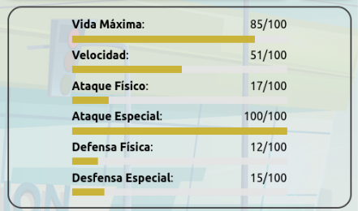
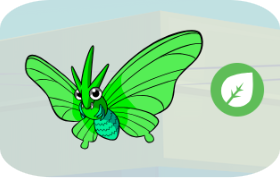
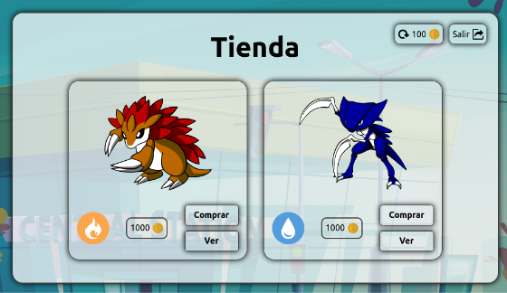

# Reactmon: Guía

## Tipos Elementales

Fuego > Planta > Agua > Fuego

Neutro no es débil ni fuerte contra ningún elemento (solo disponible para ataques).

Las criaturas pueden aprender ataques de su tipo, del tipo Neutro y del tipo contra el que son débiles:

- Fuego aprende: Fuego, Neutro, Agua.
- Planta aprende: Planta, Neutro, Fuego.
- Agua aprende: Agua, Neutro, Planta.

Usar un ataque del mismo tipo que la criatura que lo lanza otorga daño extra.

Si la criatura que recibe el ataque es débil contra el tipo del ataque recibe daño extra, pero si la criatura es fuerte contra el tipo del ataque recibe daño reducido.

## Categorías de Ataque

### Ataque Físico

Reduce la vida del objetivo aumentando el daño según el ataque físico de la criatura que realiza el ataque y reduciendo el daño según la defensa física de la criatura que lo recibe.

### Ataque Especial

Reduce la vida del objetivo aumentando el daño según el ataque especial de la criatura que realiza el ataque y reduciendo el daño según la defensa especial de la criatura que lo recibe.

### Ataque de Apoyo

Aplica efectos beneficiosos al usuario:

- Mejora de Estadística: Mejora permanente (hasta debilitamiento o cambio) de una estadística concreta. Todas las estadísticas tienen su ataque de mejora asignado excepto la vida máxima. Se pueden acumular varias capas de la misma mejora.
- Curación: Regenera una cantidad fija de vida por uso.

La mejora por usar ataques del mismo tipo que la criatura que los lanza también se aplica a los ataques de apoyo.

## Estadísticas

- Vida Máxima: Cantidad máxima de puntos de vida que puede tener la criatura completamente curada.
- Velocidad: Establece que criatura ataca primero durante el combate.
- Ataque Físico: Determina la potencia de los ataques Físicos.
- Ataque Especial: Determina la potencia de los ataques Especiales.
- Defensa Física: Determina la reducción de daño de los ataques Físicos recibidos.
- Defensa Especial: Determina la reducción de daño de los ataques Especiales recibidos.

Cada tipo Elemental tiene dos estadísticas relacionadas:

- Planta: Vida Máxima y Velocidad.
- Fuego: Ataque Físico y Ataque Especial.
- Agua: Defensa Física y Defensa Especial.

Esta relación entre estadísticas y tipos sirve para ayudar a determinar el color de las criaturas y para decidir cómo asignar los tipos de los ataques de Apoyo de cada estadística.

## Criaturas

Todas las criaturas tienen la misma cantidad de estadísticas totales, pero su repartición es aleatoria.

La imagen que representa a la criatura depende de su estadística principal (la más alta) o estadísticas principales si tiene varias estadísticas con valores cercanos a la principal.

El color general depende del tipo (Rojo, Verde, Azul), pero el tono (más claro o más oscuro) depende de la estadística relacionada con el tipo que más destaque por ser más alta o baja.

El tipo no está influenciado por la repartición de estadísticas por lo que las estadísticas relacionadas pueden no ser ninguna de las estadísticas principales.

## Tienda

Cada 10 rondas aparecerá una tienda en la que intercambiar las monedas acumuladas por criaturas.

Se puede pagar una pequeña suma por cambiar las criaturas disponibles.

En todo momento se puede consultar la información de las criaturas antes de comprarlas.

Las criaturas compradas pueden añadirse al equipo o se puede extraer uno de sus ataques para enseñárselo a una criatura del equipo.

Siempre que haya suficientes monedas se pueden comprar tantas criaturas como se quiera hasta que se decida salir de la tienda.
